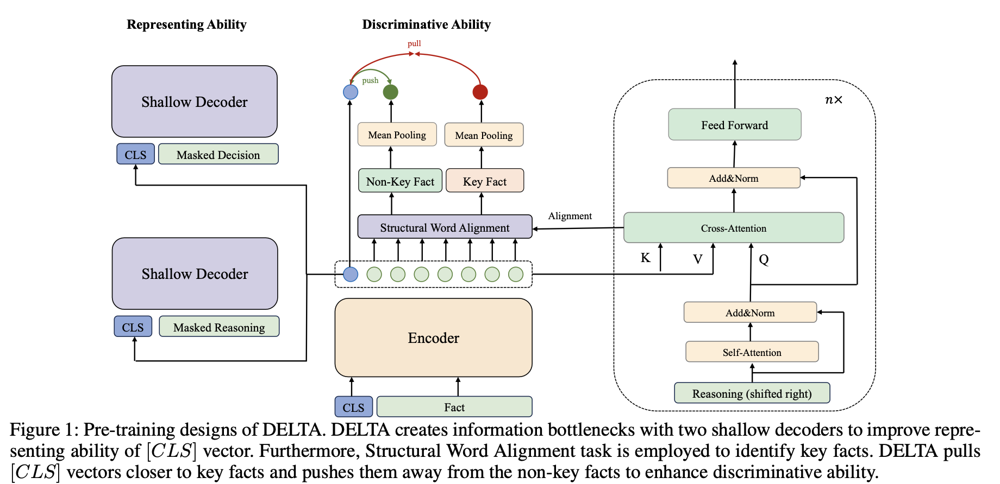

# DELTA: Discriminative Encoder for Legal Case Retrieval via Structural Word Alignment


This repository contains the source code for the AAAI'25 Full paper [DELTA](https://arxiv.org/pdf/2403.18435).
DELTA is a novel pre-training framework designed to improve legal case retrieval by enhancing the discriminative ability of representations in the legal domain. By leveraging Structural Word Alignment, DELTA identifies key facts in legal documents and aligns them with their corresponding legal reasoning.

## Key Features
- Structural Word Alignment: Highlights and aligns key facts between the "Fact" and "Reasoning" sections of legal cases.
- Shallow and Deep Decoders: Incorporates shallow decoders for efficient representation learning and a deep decoder for unsupervised word alignment.
- Contrastive Learning: Optimizes embeddings for improved discrimination between relevant and non-relevant legal cases.
- State-of-the-Art Results: Demonstrated superior performance on both Chinese and English legal benchmarks, including LeCaRD, CAIL2022-LCR, and COLIEE.



## Installation

### Requirements
```
python=3.8
transformers==4.27.1
tqdm==4.65.0 
datasets==2.10.1
torch==1.11.0
faiss==1.7.3 
pytorch==1.12.1
pyserini==0.20.0
jieba==0.42.1 
```

<!-- ### Released Models


We have uploaded some checkpoints to Huggingface Hub.

| Model              | Description                                               | Link                                                         |
| ------------------ | --------------------------------------------------------- | ------------------------------------------------------------ |
| DELTA_zh          | Pre-training on Chinese criminal law legal case documents               | [CSHaitao/DELTA_zh]()    |
| DELTA_en          | Pre-trianed on English legal case documents                | [CSHaitao/DELTA_en]() |
| DELTA_en_finetune | Finetune the DELTA_en on the COLIEE training data | [CSHaitao/DELTA_en_finetune]()             

You can load them quickly with following codes:

```
from transformers import AutoModel
model = AutoModel.from_pretrained('CSHaitao/DELTA_zh')
``` -->


## Pretrain

### Data format

Before pre-training, you need to process the data into the following form:
```
{   
    "fact": basic fact,
    "interpretation": reasoning section, 
    "articles": related criminal law articles,
    "judgment": decision section,
}

```
`data_example.json` provides some examples of training data.

The case law system does may not have relevant articles. We can correspondingly modify `DELTA_Collator` in data.py to implement pre-training.

The pre-trained corpus is not publicly available due to data permissions. The legal case documents can be downloaded from [Einglish](https://case.law/) or [Chinese](https://wenshu.court.gov.cn/).

### Train

We can pre-train model with ```sh sailer.sh```

```
CUDA_VISIBLE_DEVICES=1,5,6,8 python -m torch.distributed.launch \
    --use-env \
    --nproc_per_node 3 \
    --master_port 29508 \
    run_pretraining.py \
    --model_name_or_path xxxxx \
    --output_dir $OUTPUT_DIR/model/Delta \
    --do_train \
    --logging_steps 50 \
    --save_steps 500 \
    --fp16 \
    --logging_dir $OUTPUT_DIR/tfboard/$MODEL_NAME \
    --warmup_ratio 0.1 \
    --per_device_train_batch_size $BATCH_SIZE_PER_GPU \
    --gradient_accumulation_steps $GRAD_ACCU \
    --learning_rate 5e-6 \
    --overwrite_output_dir \
    --dataloader_drop_last \
    --dataloader_num_workers 4 \
    --max_seq_length 512 \
    --num_train_epochs 10 \
    --train_path all_text_train.json \
    --weight_decay 0.01 \
    --encoder_mask_ratio 0.15 \
    --decoder_mask_ratio 0.50 \
    --use_decoder_head \
    --enable_head_mlm \
    --ddp_find_unused_parameters True \
    --n_head_layers 1 \
    --info_nce_coef 1 \
    --temperature 2 \
    --top_align 0.65 \
    --n_deep_decoder_layers 6 \
    --translation_coef 1 \
    --model_save_path ../model/test

```


## Finetune

### Data format

Before finetuning, you need to process the data into the following form:
```
{'query': TEXT_TYPE, 'positives': List[TEXT_TYPE], 'negatives': List[TEXT_TYPE]}
...
```
### Train

To finetune the dense retriever, call the dense.driver.train module:

```
python -m dense.driver.train \  
  --output_dir $OUTDIR \  
  --model_name_or_path bert-base-uncased \  
  --do_train \  
  --save_steps 20000 \  
  --train_dir $TRAIN_DIR \
  --fp16 \  
  --per_device_train_batch_size 8 \  
  --learning_rate 5e-6 \  
  --num_train_epochs 2 \  
  --dataloader_num_workers 2
```

More finetune code details can be found in [Dense](https://github.com/luyug/Dense). Note that we simply modify the `faiss_retriever.retriever`, which may make a slight difference to the results.

## Evaluation

[trec_eval](https://trec.nist.gov/trec_eval/) is employed to evaluate the model performance

You can run `sh eval.sh` to do a simple evaluation
```
trec_eval-9.0.7/trec_eval ../result/qrel.trec ../result/result -m all_trec
```


## Citations

If you find our work useful, please do not save your star and cite our work:

```
@misc{li2024deltapretraindiscriminativeencoder,
      title={DELTA: Pre-train a Discriminative Encoder for Legal Case Retrieval via Structural Word Alignment}, 
      author={Haitao Li and Qingyao Ai and Xinyan Han and Jia Chen and Qian Dong and Yiqun Liu and Chong Chen and Qi Tian},
      year={2024},
      eprint={2403.18435},
      archivePrefix={arXiv},
      primaryClass={cs.IR},
      url={https://arxiv.org/abs/2403.18435}, 
}
```
